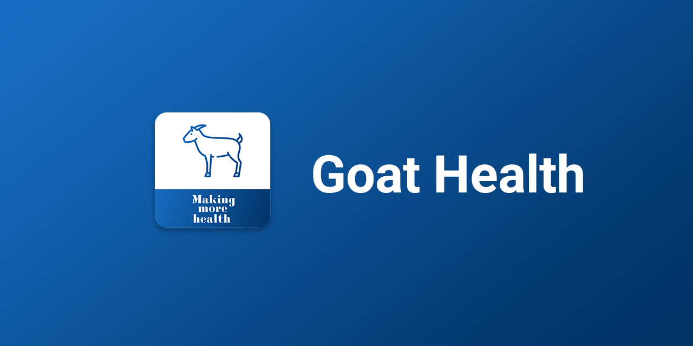

<h1 align="center" style="border-bottom: none;">Goat Health App</h1>
<p align="center">
   
</p>
<p align="center">
  <a href="https://github.com/SimonGolms/goat-health-app/actions/workflows/release-production.yml">
    
  </a>
  <a href="https://github.com/SimonGolms/goat-health-app/actions/workflows/release-beta.yml">
    
  </a>
  <a href="#badge">
    
  </a>
</p>

## Local Development

### Requirements

- NodeJS 14+
- NPM 6+
- Ionic

### Set Environment Variables

See `.env.template` to create appropriate `.env.local` file

### Install Dependencies

```sh
npm install
```

### Generate Optimized Images

```sh
npm run generate:images
```

Generate an optimized [`webp`](wikipedia.org/wiki/WebP) format in different resolutions of the images under `resources/images` with the help of [Squoosh](https://squoosh.app/) and store it under `public/assets/img`.

### Start Development Server

```sh
ionic serve
```

Runs the app in the development mode. Open [http://localhost:8100](http://localhost:8100) to view it in the browser.\
The page will reload if you make edits. You will also see any lint errors in the console.

### Create Production Build

```sh
npm run build:ionic:browser
```

Builds the app for production to the `build` folder. It correctly bundles React in production mode and optimizes the build for the best performance.\
The build is minified and the filenames include the hashes. The app is ready to be deployed!

## Continuos Deployment

1. Install Dependencies
   `npm install`
2. (on branch master/next/beta) Get Release Information (Changelog & Release Version) \

   ```sh
   npm run release:information
   ```

   Creates Release Notes and the next version from git commits.
   The next version is stored under `.VERSION` and updates the npm package version.
   The release notes are stored under `.NOTES`.

3. Generate Optimized Images

   `npm run generate:images`

4. Build

   `npm run build:ionic:browser`\
   `ionic capacitor sync ios --prod`

5. Generate Screenshots

   1. Generate Screenhots for en-US

      `JEST_PLAYWRIGHT_CONTEXT_OPTION_LOCAL=en-US JEST_PLAYWRIGHT_SCREENSHOT_SEARCH_QUERY=feed npm run generate:screenshots`

   2. Generate Screenhots for ta-IN

      `JEST_PLAYWRIGHT_CONTEXT_OPTION_LOCAL=ta-IN JEST_PLAYWRIGHT_SCREENSHOT_SEARCH_QUERY=உலர்ந்த npm run generate:screenshots`

6. Goto ios app folder

   `cd ios/App`

7. Install Dependencies

   `bundle install`

8. Run Fastlane

   `bundle exec fastlane`
